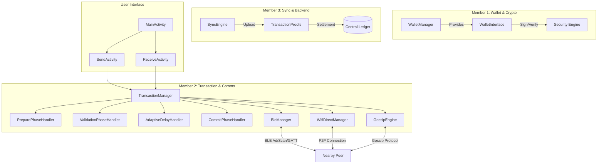

# SOTPN - Secure Offline Token-Based Payment Network

SOTPN is a decentralized, secure, and offline payment system designed for Android. It enables peer-to-peer token transfers using BLE (Bluetooth Low Energy) and Wi-Fi Direct without requiring an active internet connection.

## 🏗 System Architecture (Block Diagram)

---

## 🔐 Offline 2-Phase Commit Protocol

The system follows a strict 4-phase protocol to prevent double-spending in offline environments:

1.  **Phase 1: PREPARE (Sender)**
    *   Finds a spendable token.
    *   Locks the token in the local wallet.
    *   Signs the transaction and sends it to the receiver.
2.  **Phase 2: VALIDATION (Receiver)**
    *   Checks cryptographic signatures.
    *   Verifies token expiry (60s window).
    *   Ensures nonce uniqueness (Anti-Replay).
3.  **Phase 3: ADAPTIVE DELAY & GOSSIP (Receiver)**
    *   Broadcasts "Token Seen" messages to all nearby peers.
    *   Waits for a calculated delay based on peer density.
    *   Aborts if a conflict (double-spend) is reported by the Gossip Engine.
4.  **Phase 4: COMMIT (Receiver & Sender)**
    *   **Receiver**: Signs an ACK and sends it to the sender; stores the token.
    *   **Sender**: Verifies the ACK and marks the token as permanently **SPENT**.

---

## 🧪 Testing Suite

The project includes a comprehensive unit testing suite to ensure protocol integrity.

### **ValidationPhaseHandlerTest (10 Tests)**
| Test Case | Description |
| :--- | :--- |
| `testValidTransaction_passesAllChecks` | Verifies full protocol success. |
| `testMissingFields` (4 cases) | Catches malformed JSON or missing IDs/Signatures. |
| `testInvalidSignature` | Ensures forged transactions are rejected. |
| `testExpiredTransaction` | Rejects tokens older than 60 seconds. |
| `testFutureTransaction` | Rejects tokens with invalid future timestamps (Clock Skew). |
| `testReplayAttack` | Ensures a single nonce cannot be used twice. |
| `testGossipConflict` | Rejects transaction if another peer reports the token is already in use. |

### **Model & Utility Tests**
*   **`TransactionAckTest`**: Verifies JSON serialization and field integrity for the Phase 4 ACK.
*   **`AdaptiveDelayCalculatorTest`**: Verifies delay logic (3s for high density, 10s for low density).
*   **`NonceStoreTest`**: Verifies atomic "check-and-record" behavior.

---

## 🛠 Recent Fixes
*   **Theme Compatibility**: Resolved `IllegalStateException` by migrating to `Theme.AppCompat`.
*   **Protocol Alignment**: Refactored `TransactionAck` and `CommitPhaseHandler` to include `tokenId` and proper signature verification in the final commit stage.
*   **Test Environment**: Configured Robolectric and Mockito for reliable Android-context unit testing.

---

## 🚀 Getting Started
1.  **Sync Project**: Open in Android Studio and perform a Gradle Sync.
2.  **Run Tests**: Right-click `app/src/test/java` and select **Run 'All Tests'**.
3.  **Deploy**: Run on two physical Android devices to test BLE/Wi-Fi Direct peer discovery.
